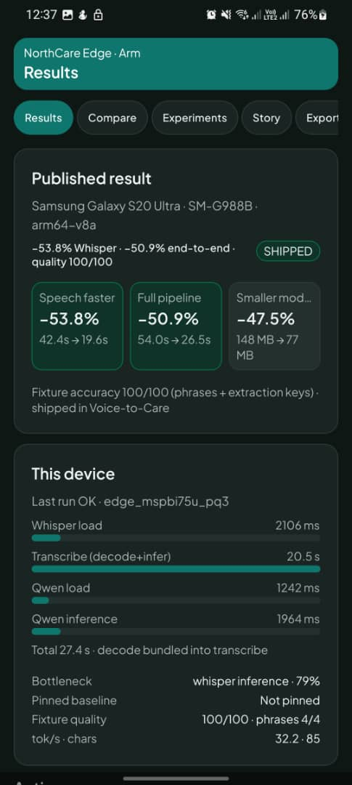
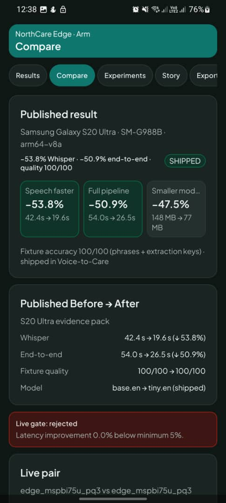
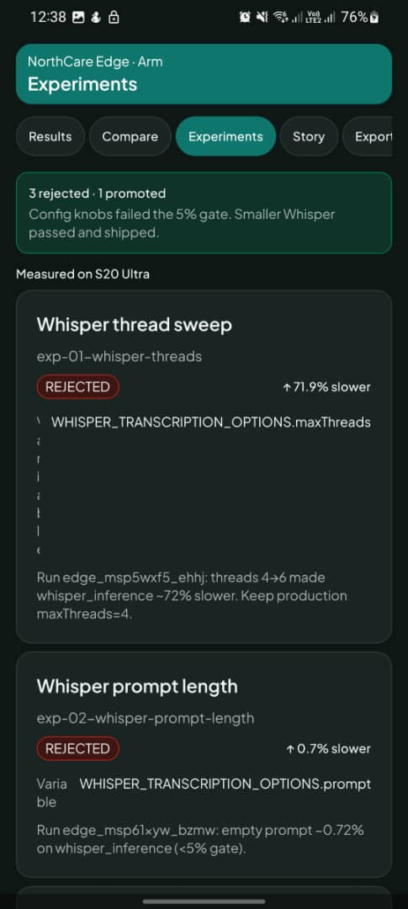
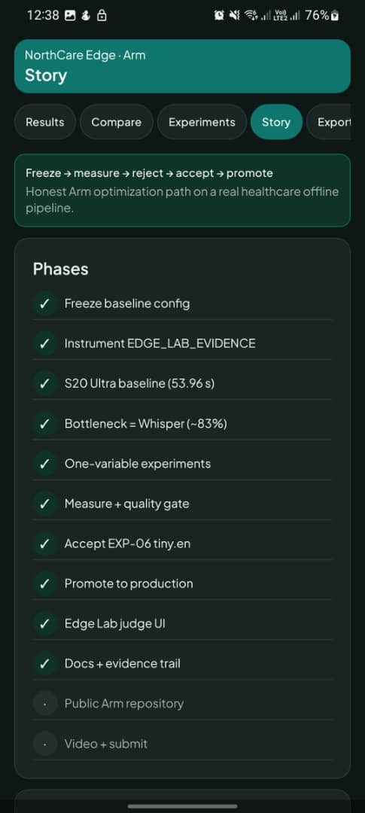
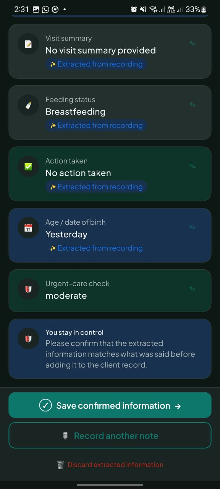
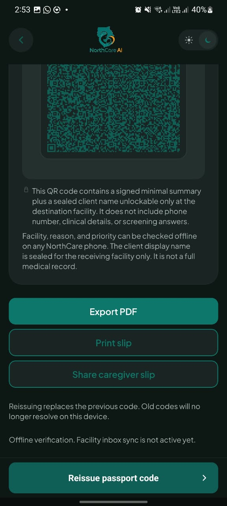
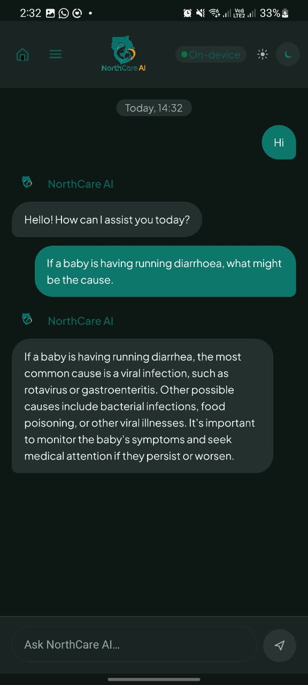
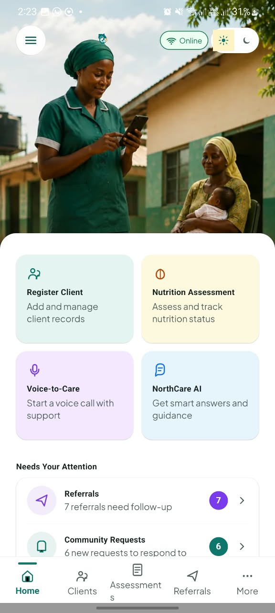

# NorthCare Edge

### Arm-optimized offline voice intelligence for frontline healthcare

**One Arm phone. Two local AI models. Zero cloud inference.**

> Speech recognition, structured extraction, Ask NorthCare, and offline referral QR verification are designed to run **on the device**. Care does not wait for the cloud.

**Author:** [Hamdan Salifu Polibu](https://github.com/hamdansalifupolibu)  
BSc Computer Science & Engineering · University of Mines and Technology (UMAT)  
Submitted to the **Arm AI Optimization Challenge 2026**

---

## The story

In Northern Ghana, a home visit does not pause for a weak signal. **NorthCare Edge** is an Arm-focused optimization of an Android-first, offline-first care app for authorised frontline health workers.

Workers document visits by voice (**Voice-to-Care**), confirm AI-extracted fields before anything is saved, hand off urgent cases with a **signed offline QR referral passport**, and ask an **on-device** assistant — without uploading clinical work to the cloud in the moment of care.

This repository is the **Arm competition release**: freeze the baseline, measure on a real Galaxy S20 Ultra (`arm64-v8a`), reject failed experiments, ship the winner, and prove it in Edge Lab.

---

## Measured results (Samsung Galaxy S20 Ultra)

| Metric | Baseline | NorthCare Edge | Improvement |
|---|---:|---:|---:|
| Whisper (decode + infer) | 42.4 s | 19.6 s | **−53.8%** |
| End-to-end AI pipeline | 54.0 s | 26.5 s | **−50.9%** |
| Whisper model size | ~148 MB (`base.en`) | ~77 MB (`tiny.en`) | **−47.5%** |
| Fixture quality | 100/100 | 100/100 | held |

Evidence runs: `edge_msp5nrdb_2sfe` (baseline) · `edge_msp6cf7n_d5qs` (accepted) · quality verify `edge_mspazssb_br9p` (tiny.en **100/100** phrases + extraction keys).

Raw JSON: [`benchmarks/raw/`](benchmarks/raw/) · Trail: [`docs/arm/BASELINE_TO_DONE_TRAIL.md`](docs/arm/BASELINE_TO_DONE_TRAIL.md)

---

## Demo video

Watch the Edge Lab walkthrough (on-device benchmark + results):

**[Open demo video (OneDrive)](https://1drv.ms/v/c/a6e600124ed58265/IQBUCYZsUx9NRqeHDfu7wqReAX8g8ULShqJiiKOHG-2q_Kc)**

Please be patient while a live benchmark runs — on-device Whisper + Qwen typically takes about **20–55 seconds** depending on model and device temperature. Stage bars update during the run; final totals appear when it completes.

---

## Edge Lab — optimization proof

Open in the app: **More → Edge Lab** (development / diagnostics build).

| Published win on device | Before → After |
|:---:|:---:|
|  |  |
| −53.8% speech · live stage bars · fixture 100/100 | base.en → tiny.en shipped with quality held |

| Honest experiments | Engineering story |
|:---:|:---:|
|  |  |
| Threads / prompt failed the 5% gate — we kept science honest | Freeze → measure → reject → accept → ship |

**Why “REJECTED” is good:** we tried config knobs first. They failed measurement. Only the smaller Whisper model cleared the quality gate and was **shipped** into production Voice-to-Care. See [`docs/arm/MEDIA_PACK.md`](docs/arm/MEDIA_PACK.md).

---

## Product — everything runs on-device

| Voice-to-Care (worker confirms) | Offline referral QR passport |
|:---:|:---:|
|  |  |
| On-device Whisper + Qwen · human-in-the-loop before save | Signed minimal summary · verify offline · no cloud round-trip for the handoff |

| Ask NorthCare (on-device) | Worker home |
|:---:|:---:|
|  |  |
| Visible **On-device** status · constrained assistant | Full offline-first field workspace |

### Offline referral QR — why it matters

When a caregiver must move between facilities **without network**, the referral does not have to wait for sync. NorthCare issues a **signed QR passport**: a minimal, privacy-preserving summary that another NorthCare phone can check **offline**. The display name stays sealed for the destination facility. That continuity of handoff is how offline engineering protects real visits — not a cloud demo.

---

## How we optimized (Arm discipline)

```text
Freeze baseline → Measure S20 Ultra → Find bottleneck (Whisper ~83%)
→ One-variable experiments → Quality gate → Ship tiny.en
```

| Experiment | Change | Verdict |
|---|---|---|
| EXP-01 | Whisper threads 4→6 | **REJECTED** (~72% slower) |
| EXP-02 | Empty prompt | **REJECTED** (<5% gate) |
| EXP-03 | `speedUp: true` | **REJECTED** (<5% gate) |
| EXP-06 | `ggml-tiny.en.bin` | **ACCEPTED + SHIPPED** (−53.8% Whisper) |

Details: [`docs/arm/EXPERIMENT_LOG.md`](docs/arm/EXPERIMENT_LOG.md) · [`docs/arm/PROMOTION_EXP06.md`](docs/arm/PROMOTION_EXP06.md) · [`docs/arm/QUALITY_GATE.md`](docs/arm/QUALITY_GATE.md)

---

## Pipeline

```text
M4A → native MediaCodec decode → Whisper (on-device)
    → transcript (worker may edit) → Qwen extract (on-device)
    → human confirm → SQLite
```

Edge Lab times the AI stages without writing clinical SQLite apply. Production Voice-to-Care always requires worker confirmation.

---

## Reproduce

1. Android development build of the app on an Arm64 device (evidence host: Galaxy S20 Ultra).  
2. Provision Whisper `ggml-tiny.en.bin` + Qwen 2.5 0.5B Q4_K_M (not committed as weights).  
3. **More → Edge Lab** → import synthetic fixture → **Run benchmark**.  
4. Compare against published numbers in `benchmarks/` and `docs/arm/`.

Device checklist: [`docs/arm/DEVICE_RUNBOOK.md`](docs/arm/DEVICE_RUNBOOK.md)

---

## Safety

- No diagnose / prescribe / dosage  
- No AI save without worker confirmation  
- Deterministic danger-sign rules are not replaced by the LLM  
- Synthetic fixtures only in Edge Lab evidence  
- Not a certified medical device  

---

## Licence

MIT — see [`LICENSE`](LICENSE). Third-party model / map notices: [`NOTICE`](NOTICE).

---

## Author

**Hamdan Salifu Polibu** — sole listed contributor for this Arm competition repository.  
GitHub: [hamdansalifupolibu](https://github.com/hamdansalifupolibu)
