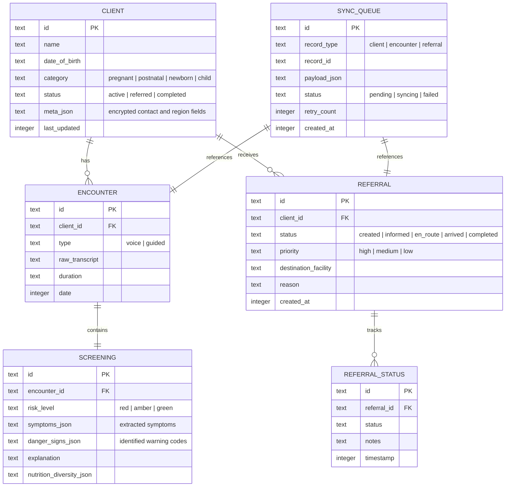
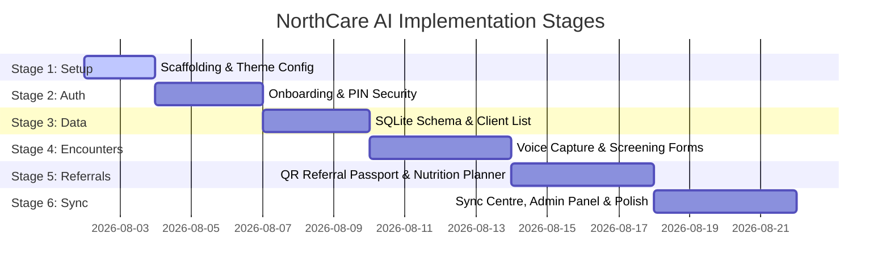

# NorthCare AI: System Architecture Specification

This document details the final technology stack, repository structure, coding standards, data architecture, environment setup, and implementation roadmap for the NorthCare AI mobile application.

---

## 1. Technology Stack

NorthCare AI is an Android-first, offline-first mobile application. The technology stack has been selected to ensure maximum offline reliability, security, accessibility, and compatibility with the target device (Samsung Galaxy S20 Ultra).

| Layer | Technology | Selection Rationale |
|---|---|---|
| **Core Framework** | **React Native (Expo SDK 51+)** | Managed workflow speeds up cross-platform development while supporting native builds. Expo provides robust libraries for SQLite, SecureStore, and audio handling. |
| **Language** | **TypeScript (Strict Mode)** | Ensures compile-time type safety for complex clinical data models (referrals, screenings, and danger sign schemas). |
| **Local Storage** | **Expo SQLite** | Relational local database serving as the offline primary source of truth. Handles structured records for clients, encounters, and referrals. |
| **Secure Storage** | **Expo SecureStore** | Encrypted key-value store for storing authentication tokens, session data, and the 6-digit user PIN. Prohibits patient data from leaking to AsyncStorage. |
| **Navigation** | **Expo Router (File-based)** or **React Navigation** | React Navigation is explicitly mapped in the Stitch handoff. We will implement React Navigation (Stack and Bottom Tab) or Expo Router mapped to the routes: `/splash`, `/onboarding`, `/login`, `/dashboard`, `/clients`, `/visit/voice`, `/referrals`, `/admin`. |
| **Audio Capture** | **expo-av** | Standard Expo module for recording audio notes in the field. Feeds the voice-to-text pipeline. |
| **Localization** | **i18n-js** | Handles translations for English (`en`) and Dagbanli (`dag`). All strings must reside in locale JSON files. |
| **UI Components** | **React Native Paper** / **Material 3** | Implements the Google Material 3 visual standards with custom styling overrides using design tokens. |
| **Vector Graphics** | **react-native-svg** | Renders custom vector logos, sync indicators, and the interactive nutrition planner donut ring. |

---

## 2. Repository Structure

The project follows a modular, feature-oriented structure inside the `/src` directory to decouple business logic, state management, UI components, and clinical services.

```
/
├── assets/                  # Public asset library (logos, illustrations, fonts)
├── docs/                    # Architecture and product orientation documents
├── src/
│   ├── assets/              # App-bundled graphics and local audio guides
│   ├── components/          # Reusable UI atoms, molecules, and organisms
│   │   ├── common/          # Buttons, Cards, Inputs, Loaders (M3 standard)
│   │   ├── dashboard/       # ActionGrid, PriorityAlerts, TipOfTheDay
│   │   ├── client/          # ClientCard, GrowthChart, RiskBadge
│   │   ├── voice/           # VoiceWaveform, LiveTranscriptBox
│   │   └── nutrition/       # NutritionRing, FoodSelector
│   ├── constants/           # Authoritative design tokens and config
│   │   ├── theme.ts         # Colors, typography, spacing, border-radius
│   │   └── config.ts        # API endpoints, sync thresholds, model keys
│   ├── hooks/               # Custom React hooks
│   │   ├── useOfflineStatus.ts # Real-time network and sync status detection
│   │   ├── useAudioRecorder.ts # expo-av recording wrapper
│   │   └── usePINAuth.ts       # SecureStore PIN validation and unlock state
│   ├── localization/        # Translation mappings
│   │   ├── en.json          # English localizations
│   │   └── dag.json          # Dagbanli localizations
│   ├── navigation/          # Route configs and tab bars (React Navigation)
│   ├── screens/             # Top-level screen components
│   │   ├── onboarding/      # Splash, Onboarding slides, WorkspaceSelection
│   │   ├── auth/            # Login, CreatePIN, PinUnlock, Consent
│   │   ├── worker/          # Dashboard, ClientDirectory, ClientProfile, VisitEntry
│   │   └── admin/           # AdminDashboard, WorkerManagement
│   ├── services/            # SQLite, Sync, and AI APIs
│   │   ├── database/        # SQLite migrations, schema, and query helpers
│   │   ├── sync/            # SyncQueue coordinator and sync client
│   │   └── ai/              # Constrained parsing and transcription fallback
│   ├── utils/               # Formatting, date helpers, and validators
│   └── App.tsx              # Root component and provider wrapper
├── AppEntry.js              # Expo entry point
├── app.json                 # Expo configurations
├── package.json             # Dependencies and build scripts
├── tsconfig.json            # Strict TypeScript configuration
└── tailwind.config.js       # (If using TailwindCSS for React Native)
```

---

## 3. Data Architecture (SQLite Schema)

To support offline-first operation, the SQLite database acts as the local system of record. Every clinical activity registers a local entry first, pushing to the backend sync queue when connection state permits.



### Encryption & Security
1. **No Sensitive PII in Plaintext Logs:** Logging functions are sanitized.
2. **Encrypted local database:** In production, SQLite data is encrypted using SQLCipher or local column-level encryption for sensitive names/identifiers.
3. **SecureStore:** Stores JWT, User PIN hash, and encryption keys.

---

## 4. Coding Standards & IDE Rules

In accordance with the `.mdc` project rules extracted from the Stitch handoff:

1. **Strict Theme Reference:** No hardcoded hex color values or random font sizes. All styles must import values from `src/constants/theme.ts`.
2. **Accessibility Enforcement:** Every touchable or interactive element (`TouchableOpacity`, `Pressable`, `Button`) must provide a descriptive `accessibilityLabel` for screen readers.
3. **Haptic Feedback:** Interactive buttons (like biometric verification, mic record, and QR scanner) must trigger native haptics.
4. **Offline Hooks:** Components that rely on connectivity must utilize the custom `useOfflineStatus` hook to render warning banners or disable sync actions gracefully.
5. **Mandatory Translation Keys:** All UI strings must use translation keys from `en.json` and `dag.json` via the internationalization framework. Raw text strings inside elements are prohibited.
6. **Linting Rules:** ESLint and Prettier enforce clean, consistent formatting, restricting unused imports and enforcing implicit returns where appropriate.

---

## 5. Implementation Roadmap (Phased Approach)

To ensure high-quality execution and reproducible builds, development is split into 6 stages.



### Phase Details

*   **Stage 1: Core Scaffolding & Design Token Setup**
    *   Initialize Expo application with TypeScript and routing skeleton.
    *   Configure theme constants mapping to the exact primary teal (`#005C55`) and amber (`#F59E0B`) token structures.
    *   **Deliverable:** Working project skeleton running on Android emulator with matching styling tokens.
*   **Stage 2: Onboarding, Authentication & PIN Security**
    *   Build animated splash screen, onboarding slides, and workspace selection.
    *   Implement worker login, SecureStore-backed PIN creation, and PIN unlock screens.
    *   **Deliverable:** Secure onboarding-to-login gate working fully offline.
*   **Stage 3: Offline Data Layer & Client Directory**
    *   Deploy SQLite database migrations and query services.
    *   Implement Client Directory screen, multi-step Client Registration, and dynamic Client Profile.
    *   **Deliverable:** Ability to create, save, search, and view local clients offline.
*   **Stage 4: Encounter Flow & Voice-to-Care Capture**
    *   Implement Visit Entry selector and the Voice Capture recorder interface.
    *   Build the Symptom Extraction Review sheet, rule-based screening engine, and Explainable Risk screen.
    *   **Deliverable:** Spoken cases transcribed (or simulated locally) and evaluated against danger sign rules.
*   **Stage 5: Last-Mile Referrals & Localized Nutrition Planner**
    *   Build Referral Creation screen and animated QR Referral Passport generator.
    *   Develop the Nutrition Planner page featuring the SVG food diversity ring and local Dagbanli audio advice cards.
    *   **Deliverable:** Visual clinical referral passport and diet advice layout.
*   **Stage 6: System Integration, Mock Sync Engine & Admin Panel**
    *   Implement the Sync Centre dashboard, local storage meters, and sync history.
    *   Construct the regional Admin Dashboard and worker directory tables.
    *   Verify lint compliance, accessibility target scaling, and perform final build testing.
    *   **Deliverable:** Fully functional production-ready hackathon MVP submission.
