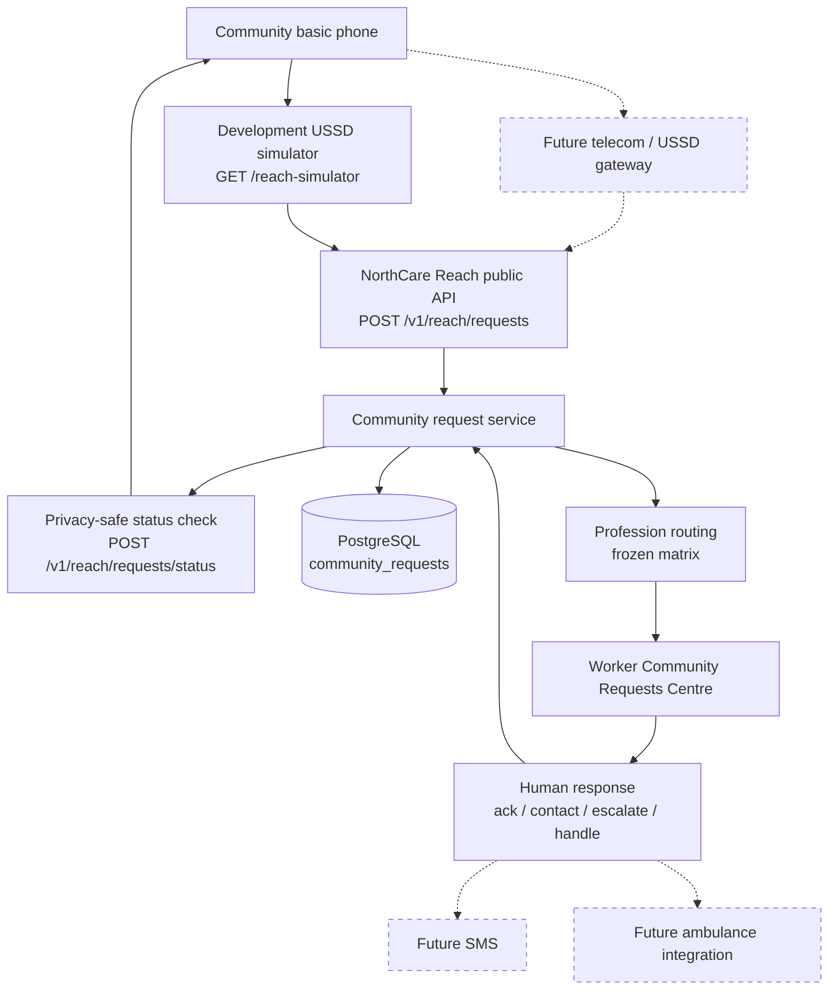

# NorthCare Reach — Architecture

**Status:** R0 freeze retained; **R1–R6 packaged** (profiles + backend + USSD simulator + Worker request centre + emergency simulation + demo integration)  
**Last updated:** 2026-08-03  

## Position relative to NorthCare AI

NorthCare Reach is a **hackathon extension track** on top of the completed Stages 1–18 worker application and `services/api` stack. It does **not** replace Worker or Administration workspaces. Stage 19 remains paused until Reach R6 manual validation is approved.

Preserve existing stack: Expo SDK 57, Expo Router, FastAPI, PostgreSQL, Alembic, Expo SQLite, multi-role auth, sync, clinical features, a11y/security controls, production fail-closed behaviour.

### Implementation progress

| Stage | Status |
|---|---|
| R0 Scope / safety / design freeze | Complete |
| R1 Worker profession + admin integration | Complete |
| R2 Community request backend / routing | Complete |
| R3 USSD simulator | Complete |
| R4 Worker Community Requests Centre | Complete |
| R5 Emergency Coordination Simulation | Complete |
| **R6 Integration / demo preparation** | **Complete (awaiting manual validation)** |

## Demo story architecture



Dashed nodes are **future** integrations and are **not active** in the prototype.

```text
[Basic-phone user]
        │
        ▼
[USSD simulator — R3 — GET /reach-simulator]
        │  POST /v1/reach/requests (R2 live, gated)
        │  POST /v1/reach/requests/status (R2 live, gated)
        ▼
[Community Request service — PostgreSQL — R2]
        │  deterministic profession routing
        ▼
[Worker Community Requests Centre — R4/R5 mobile]
        │  acknowledge / escalate / contact / handle (R2 APIs)
        ▼
[Privacy-safe public status check — R2]
```

Mobile architecture details: `docs/architecture/COMMUNITY_REQUEST_MOBILE_ARCHITECTURE.md`.  
Emergency UI: `docs/design/NORTHCARE_REACH_EMERGENCY_UI.md`.  
Demo packaging: `docs/development/NORTHCARE_REACH_DEMO_RUNBOOK.md`.

## Preferred simulator approach

Lightweight static web UI served by the existing FastAPI service:

- Path: `services/api/static/reach-simulator/`  
- Files: `index.html`, `reach.css`, `reach.js`  
- Route: `GET /reach-simulator` (development demo gate only)

Must resemble a basic-phone USSD session (one menu at a time, numeric choices, Back, reset), submit synthetic requests to the development backend, check generic status, and display the simulation label.

**Do not** create a second React/Node app, telecom emulator, or production shortcode integration in the MVP.

## API surfaces

| Surface | Endpoints | Status |
|---|---|---|
| Admin professions / profile | `GET /v1/admin/professions`, `PATCH /v1/admin/accounts/{accountId}/professional-profile`, register fields | **Live (R1)** |
| Public create / status | `POST /v1/reach/requests`, `POST /v1/reach/requests/status` | **Live (R2)** |
| USSD simulator UI | `GET /reach-simulator` | **Live (R3)** — demo gated |
| Worker community requests | `GET/POST` under `/v1/worker/community-requests...` | **Live (R2)** — mobile UI in R4; escalate UI in R5 |
| Demo reset / seed | CLI only (`python -m northcare_api.cli.reset_reach_demo` / `seed_reach_demo`) | **Live (R6)** — development only; no public HTTP reset |

## Data placement

| Concern | Home |
|---|---|
| Professional profiles | API PostgreSQL table `worker_professional_profiles` (Alembic `0004`) — profession ≠ system role |
| Community requests | API PostgreSQL `community_requests` (Alembic `0005`) |
| Mobile admin UI | In-memory / short-lived API responses; **no** mobile SQLite migration for workforce profiles |
| Simulator | Static assets on API process (R3) |
| Mobile Community Requests | Online API client only; no SQLite request repository |

## Notification boundary

Remote push is **not** active. Community Requests refreshes on open / foreground / manual refresh; optional badge after fetch. Generic local feedback only after fetch. No claim of closed-app / real-time / background-sync delivery. Notification copy must stay generic (no category, location, phone, or emergency details).

## Trust and simulation honesty

- Emergency and telecom paths are **simulations**.  
- No claim that ambulance or CHPS facility systems were contacted.  
- Human acknowledgement remains required.  
- Public status responses are privacy-safe generics only.  
- Handled means workflow closure, not clinical care completion.  

## Related docs

- Domain model, routing, professional profile under `docs/architecture/`  
- Safety / privacy / public endpoint / simulator security boundaries  
- Future phases: `docs/development/NORTHCARE_REACH_FUTURE_EXPANSION.md`  
- Roadmap: `implementation/reach-roadmap.json`  
