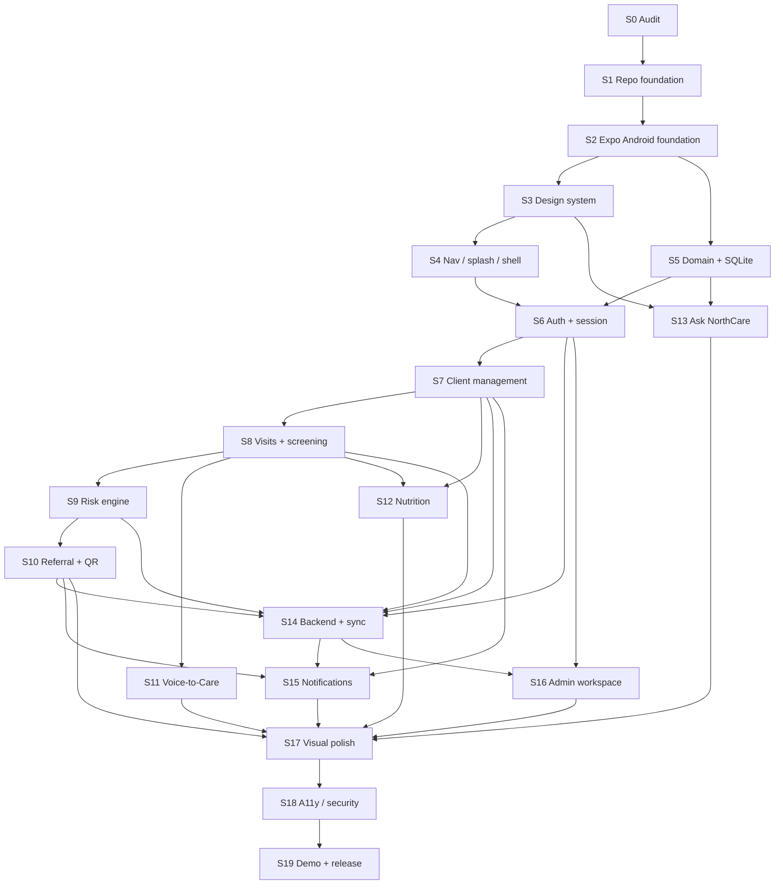

# Stage Dependency Map

**Product:** NorthCare AI  
**Stitch project ID:** `749026157623860355`  
**Last updated:** 2026-08-02

## Critical path (serial)

```text
S0 Audit
 → S1 Repository foundation
 → S2 Expo TypeScript / Android environment
 → S3 Design system & components
 → S4 Navigation, splash, onboarding, shell
 → S5 Domain models, SQLite, repositories
 → S6 Auth, local session, secure access
 → S7 Client management vertical slice
 → S8 Visits & guided screening
 → S9 Deterministic risk engine
 → S10 Referral + QR passport
 → S11 Voice-to-Care + extraction review
 → S12 Nutrition assessment & guidance
 → S14 Backend, sync, conflicts          ← after core offline clinical path
 → S15 Notifications & follow-ups
 → S17 Stitch visual / motion refinement
 → S18 Accessibility, security, quality
 → S19 Testing, demo & release prep
```

## Full dependency graph



## Safe parallel work (only after prerequisites)

| Parallel pair | Condition | Risk if forced early |
|---|---|---|
| S3 ∥ early S5 schema drafting | After S2; no UI binding until S5 lands | Schema churn breaking screens |
| S11 mock extraction UI ∥ S9 rules | After S8; do not wire real AI until review UI + rules exist | Unsafe AI path |
| S12 content placeholders ∥ S10 | After S7/S8 | Fake nutrition guidance treated as final |
| S13 content stubs ∥ S12 | After S3 + S5 + approved content inventory | Assistant invents answers |
| S16 admin stubs | After S6; full admin after S14 | Admin without sync/RBAC |

## Dependency rationale (changes from default)

| Adjustment | Why |
|---|---|
| **S11 after S8, not before S9** | Voice is an input path into the same screening pipeline; guided screening must exist first as fallback. Risk engine (S9) should exist before real extraction is treated as clinical input. |
| **S14 after S10** | Demo can show local “waiting to sync”; real sync is valuable but mock sync queue can appear earlier inside S5/S10. Full backend remains post-offline clinical path. |
| **S13 after content contracts** | Assistant is P1/P2 for demo depth; must not block P0 clinical path. |
| **S16 after S14** | Admin needs organisation-wide sync health; not on P0 demo critical path. |
| **S15 can use local notifications before push** | In-app + local scheduled notifications can ship with local data; push waits for S14. |

## P0 path stages (minimum for competition demo)

`S0 → S1 → S2 → S3 → S4 → S5 → S6 → S7 → S8 → S9 → S10 → (S11 or guided-only) → S12 (lite) → S14 (mock or real sync) → S15 (local) → S17 (focused) → S18 (focused) → S19`

See `MVP_DELIVERY_PLAN.md` for the compressed P0 sequence.
