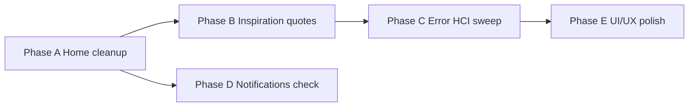

# Worker Home UX, Inspiration Quotes & HCI Error Plan

**Created:** 2026-08-08  
**Status:** Phase A–C implemented (2026-08-08). Phase C error mappers extended (2026-08-09). Phase C emulator spot-test 5/5 (2026-08-10). Phase E UI/UX polish pending.
**Audience:** Product owner, hackathon demo, post-demo UX hardening  
**Scope:** Mobile worker shell only (`apps/mobile`). No new backend stages.

---

## Goals

1. Make **Worker Home** calm, motivating, and uncluttered — summary cards for “today”, clear primary actions below.
2. Add **time-aware inspiration** for frontline workers (not clinical advice).
3. Keep **NorthCare Reach USSD demo** in **Community Requests** only (hackathon path stays obvious there).
4. Apply **HCI error principles** app-wide: prevent, explain in plain language, offer recovery — never raw system errors to workers.
5. Confirm **notification privacy** remains generic and reliable.
6. Prepare for a later **UI/UX design pass** (Stitch fidelity, spacing, motion).

---

## What we have today (baseline)

| Area | Current state |
|------|----------------|
| Worker Home | Title + worker info + **Today on duty** cards (reminders, community, sync) + **Reach USSD launcher (duplicate)** + 9 feature buttons |
| Duplication | Summary cards **and** buttons for Reminders, Community Requests, Sync Centre |
| Reach demo | On home **and** Community Requests Centre |
| Errors | Mix of good mappers (auth, community, nutrition, referrals) + gaps (raw `err.message`, `ReferenceError` leaks via boundary in dev) |
| Notifications | Generic title/body only — privacy-safe (Stage 15) |

---

## Recommended implementation phases

### Phase A — Homepage declutter & priority order (≈2–3 hours)

**Low risk, high impact. Do first.**

#### A1. Move Reach USSD demo off home

- **Remove** `ReachUssdDemoLauncher` from `WorkerHomeDashboard.tsx`.
- **Keep** full launcher at top of `CommunityRequestsCentreScreen.tsx` (already there).
- Update hackathon doc: demo script starts from Community Requests or home card → Community Requests.

#### A2. Remove duplicate navigation buttons

Remove from `app/(worker)/index.tsx`:

- `openReminders` button (covered by **Reminders** summary card)
- `openCommunityRequests` button + subtitle caption (covered by **Community requests** card)
- `openSyncCentre` button (covered by **Sync** summary card) — *recommended for consistency; confirm if you want to keep a secondary entry*

#### A3. Reorder remaining feature buttons (importance)

Proposed order for **Northern Ghana frontline CHPS worker** daily flow:

| Priority | Button | Rationale |
|----------|--------|-----------|
| 1 | **Clients** | Core register / find client — start of most workflows |
| 2 | **Nutrition** | Active demo + clinical slice; high visibility for hackathon |
| 3 | **Voice-to-Care** | Fast capture at point of care |
| 4 | **Referrals** | Continuity when escalation needed |
| 5 | **Community Requests** | *Optional text link only if card unavailable* — otherwise card only |
| 6 | **Ask NorthCare** | Support tool, not primary workflow |
| 7 | **Lock** | Security |
| 8 | **Sign out / Change account** | Tertiary |

**Visual grouping (Phase E can polish):**

```text
┌─────────────────────────────────────┐
│  [Inspiration quote card]           │  ← Phase B
│  Worker · Facility · Client count   │
├─────────────────────────────────────┤
│  TODAY ON DUTY                      │
│  [Reminders] [Community] [Sync]     │  ← tap = navigate
├─────────────────────────────────────┤
│  PRIMARY WORK                       │
│  [ Clients ]                        │
│  [ Nutrition ] [ Voice-to-Care ]    │
│  [ Referrals ]                      │
│  [ Ask NorthCare ]                  │
├─────────────────────────────────────┤
│  [ Lock ]  Sign out                 │
└─────────────────────────────────────┘
```

#### Acceptance criteria (Phase A)

- [ ] Home scroll height reduced; no USSD block on home
- [ ] Reminders & community reachable only via cards (or one intentional entry)
- [ ] Reach demo still one tap from Community Requests
- [ ] No regression on S20 wireless build

---

### Phase B — Time-aware worker inspiration quotes (≈4–6 hours + content review)

#### Design intent

- **Motivate and calm** — not diagnose, not prescribe, not fake medical protocols.
- **Time-of-day aware** — different tone for start of shift vs end of shift.
- **Offline-first** — bundled JSON in app; no network required.
- **Rotates gently** — not distracting during clinical work.

#### Time buckets (device local time)

| Bucket | Local hours (default) | Tone |
|--------|----------------------|------|
| **Morning** | 05:00 – 11:59 | Energy, preparation, community trust |
| **Afternoon** | 12:00 – 16:59 | Steady focus, patience, teamwork |
| **Evening** | 17:00 – 21:59 | Reflection, completion, self-care |
| **Night** | 22:00 – 04:59 | Rest, on-call calm, short lines |

*You asked for 20 morning + 20 afternoon + 20 evening — we can use 20 per bucket and reuse/shuffle **night** from evening subset or add 10 night-specific lines.*

#### Rotation behaviour (HCI)

| Rule | Recommendation |
|------|----------------|
| When to change | On **app open / home focus**, and at most every **30 minutes** while home stays visible |
| How to pick | Deterministic shuffle per calendar day + bucket (same quote not repeated back-to-back) |
| Animation | None or very subtle fade — respect reduced motion |
| Dismiss | Not needed; card is small, non-blocking |
| Language | English first; Dagbanli strings flagged `NOT_REVIEWED` until colleague approves |

#### Content rules (AGENTS.md aligned)

- ✅ Worker wellbeing, dignity, community, offline resilience, GHS-adjacent *values* (no invented protocols)
- ✅ Short lines (≤120 chars) + optional attribution (“— African proverb”, “— NorthCare team”)
- ❌ No dosage, diagnosis, danger-sign instructions, or fabricated Dagbanli clinical text
- ❌ No UNICEF/WHO logos or implied endorsement without approval

#### Technical sketch

```
apps/mobile/src/features/worker-home/
  content/workerInspirationQuotes.en.json   (~60 entries, tagged by bucket)
  content/workerInspirationQuotes.dg.json   (placeholder until review)
  domain/selectInspirationQuote.ts          (bucket + rotation logic)
  components/WorkerInspirationCard.tsx      (calm card under header)
  hooks/useWorkerInspirationQuote.ts
```

Strings in `en.ts`: `workerHome.inspirationLabel` (e.g. “For today’s shift”).

#### Acceptance criteria (Phase B)

- [ ] Quote visible on Worker Home; changes by time bucket
- [ ] No clinical advice in quote corpus
- [ ] Content list reviewed by you before merge (spreadsheet or markdown appendix)
- [ ] Unit tests for bucket selection + rotation seed

---

### Phase C — HCI error management sweep (≈1–2 days)

#### Principles (Norman / Shneiderman adapted for NorthCare)

1. **Prevent** — validation, masks, helper text, disabled submit until valid
2. **Plain language** — “We couldn’t save this reminder” not `ReferenceError`
3. **Recovery** — Retry, Go back, Open Sync Centre, Contact admin — never dead ends
4. **Privacy** — errors must not echo health data, tokens, or PINs
5. **Log internally** — `logger.error` with code; user sees mapped message only

#### Current gaps (from recent S20 session)

| Issue | Example | Fix |
|-------|---------|-----|
| Missing i18n hook | `Property 't' doesn't exist` | Lint rule / checklist: `useTranslation()` required when using `t.` |
| Module-level strings | `nutritionStrings` in helper | Pass strings as params or use hooks inside components |
| Raw `err.message` | Some catch blocks | Route through feature `mapXError()` |
| Dev boundary noise | LogBox shows stack | Boundary already generic in prod; ensure mappers before render |

#### Implementation layers

| Layer | Action |
|-------|--------|
| **L1 Shared** | Extend `mapSafeUserMessage(error, context)` in `src/error/` |
| **L2 Features** | Audit each feature’s catch → mapper (nutrition, voice, reminders, sync, community) |
| **L3 Forms** | `AppTextInput`: `helperText`, `placeholder`, `keyboardType`, `maxLength` audit on register/client/reminder forms |
| **L4 Boundary** | User copy: “Something went wrong on this screen” + Retry + optional “Return home” |
| **L5 Dev only** | Diagnostics toggle stays behind `diagnosticsEnabled` |

#### Suggested priority order for error audit

1. Auth & unlock (already strong)
2. Reminders + notifications
3. Community requests + Reach demo
4. Nutrition + client register
5. Voice + Ask NorthCare
6. Sync centre
7. Referrals

#### Acceptance criteria (Phase C)

- [x] No user-facing raw exception names (`ReferenceError`, `TypeError`, HTTP 502)
- [x] Every form field has placeholder or helper where format is non-obvious (reminders, client register phone, referral notes)
- [x] Error checklist doc for new screens — see `docs/development/ERROR_HANDLING_CHECKLIST.md`
- [x] Spot-test on emulator (`npm run spot-test:phase-c`): 5/5 passed (2026-08-10) — bootstrap, airplane/community offline, referral verify + invalid passport, reminders create, Ask NorthCare model unavailable. S20 wireless regression check still recommended before release build.

---

### Phase D — Notification re-check (≈1–2 hours)

Already aligned with Stage 15 privacy model:

- Title: “NorthCare follow-up reminder”
- Body: generic — open app to review
- No client name on lock screen

**Verify:**

- [ ] Permission flow copy still clear after home changes
- [ ] Tapping notification opens correct reminder detail
- [ ] Snooze/reschedule still schedules locally
- [ ] Denied permission path: reminder saved, in-app only (already implemented)

---

### Phase E — UI/UX design pass (after A–D)

**Separate stage** — Stitch-aligned polish:

- Section headers (“Today on duty”, “Primary work”)
- Button hierarchy (one primary, rest secondary)
- Spacing tokens, card elevation, empty states
- Optional: worker home hero / brand strip (no forged partner logos)
- Motion: reduced-motion respected

Reference: Stitch project `749026157623860355`, design tokens in repo.

---

## Suggested execution order



| Order | Phase | Why |
|-------|-------|-----|
| 1 | **A** | Immediate clutter fix; demo-friendly |
| 2 | **B** | Motivation layer; needs your quote approval |
| 3 | **D** | Quick validation while reminders fresh |
| 4 | **C** | Broader sweep; benefits from stable home |
| 5 | **E** | Visual pass last so we don’t rework layout twice |

---

## Quote content — sample direction (not final copy)

*For approval discussion — not clinical advice:*

**Morning**

- “Every community visit begins with listening.”
- “You bring care closer to home.”
- “Small steps today protect families tomorrow.”

**Afternoon**

- “Steady work saves lives — take one task at a time.”
- “Document what you know; ask when you’re unsure.”

**Evening**

- “Finish well. Rest restores your strength for tomorrow.”
- “Handled does not mean alone — escalate when needed.”

We will expand to **20 per bucket** with your sign-off before coding.

---

## Decisions needed from you

1. **Sync Centre button** — remove like reminders/community (card only), or keep a button?
2. **Quote rotation** — 30 min on home OK, or change only on each visit to home?
3. **Quote tone** — more spiritual/community proverb vs professional/clinical-adjacent?
4. **Dagbanli** — English-only for hackathon, or include draft Dagbanli with review banner?
5. **Phase C scope** — full app audit now, or worker-facing flows only first?

---

## Files likely touched (when approved)

| Phase | Files |
|-------|--------|
| A | `app/(worker)/index.tsx`, `WorkerHomeDashboard.tsx`, `HACKATHON_DEMO_IMPLEMENTATION_PLAN.md` |
| B | New `worker-home/content/*`, `WorkerInspirationCard.tsx`, `en.ts` / `dg.ts` |
| C | `src/error/*`, feature `*Error*.ts`, form screens, optional ESLint custom rule |
| D | `reminderDomain.ts`, `CreateReminderScreen`, notification scheduler tests |
| E | design-system, worker home layout, Stitch alignment notes |

---

## Out of scope (this plan)

- New backend / Firebase sync
- Live USSD shortcode
- AI-generated quotes at runtime
- Full Dagbanli clinical translation

---

**Next step:** Approve phases (all or A-first), answer the five decisions above, then we implement Phase A immediately and draft the 60-quote list for your review before Phase B.
